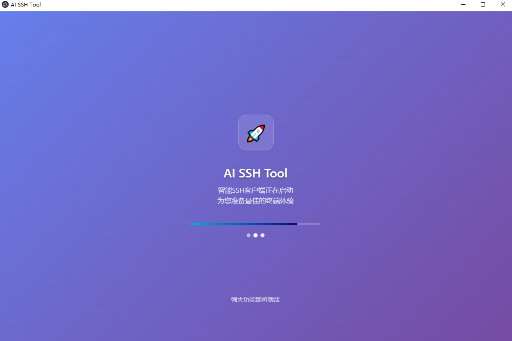
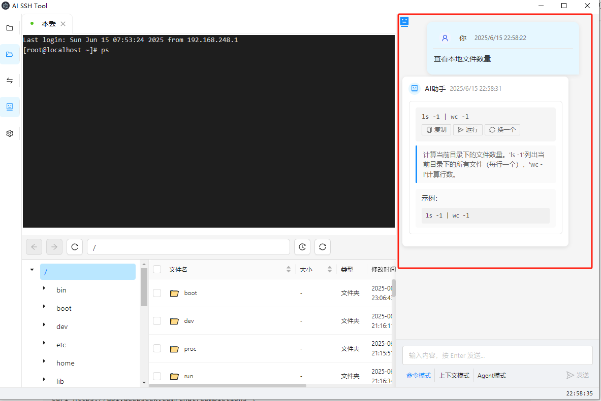
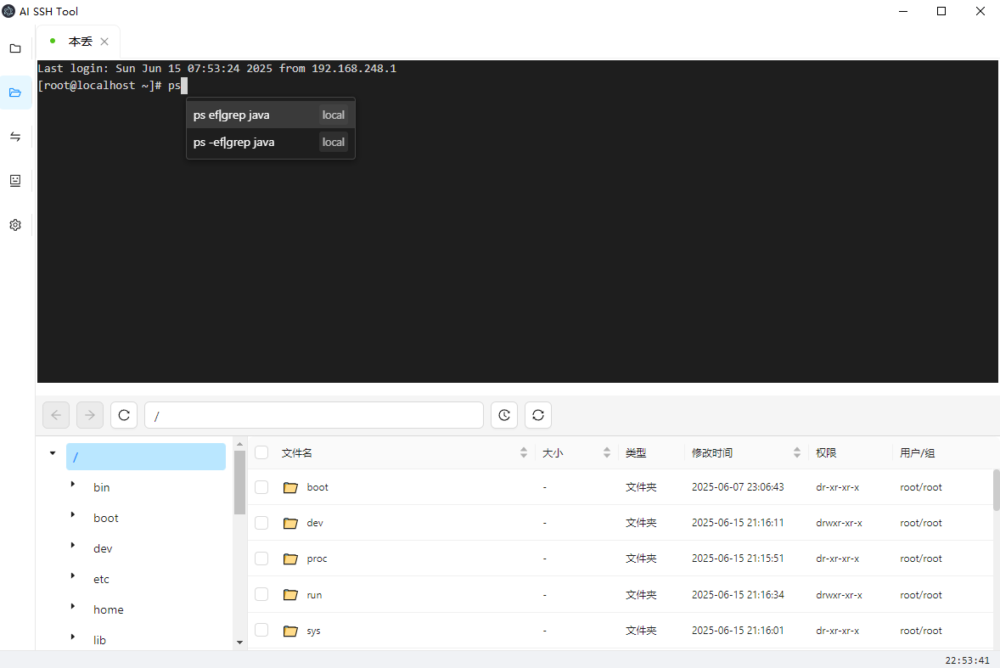

<div align="center">

# 🚀 AI SSH Tool

**下一代智能SSH客户端 - 让Linux命令行操作更简单、更智能**

[](https://opensource.org/licenses/Apache-2.0)
[](https://nodejs.org/)
[](https://electronjs.org/)
[](https://www.typescriptlang.org/)

[English](README.md) | [中文文档](README_CN.md)

</div>

<div align="center">

<br>
<em>🚀 AI SSH Tool - 下一代智能SSH客户端</em>
</div>

---

## ✨ 项目亮点

AI SSH Tool 是一款革命性的SSH客户端，将人工智能技术与传统终端操作完美融合，为开发者和运维人员提供前所未有的命令行体验。（99%代码AI写的，所以代码乱正常，功能奇怪正常，不会太经常维护，做着玩的，只测试了windows，其他系统没测），exe下载地址看发行版

### 🎯 **核心优势**

- 🤖 **AI智能助手** - 自然语言生成Linux命令，告别复杂语法记忆
- 🎨 **现代化界面** - 基于Ant Design的精美UI，支持主题定制
- ⚡ **智能补全** - 多层次补全系统，提升操作效率10倍（没怎么优化，吹牛逼的）
- 🖱️ **鼠标定位** - 点击任意位置移动光标，颠覆传统终端体验
- 📁 **可视化文件管理** - 集成SFTP文件浏览器，拖拽上传下载
- 📊 **系统监控** - 实时监控服务器性能，可视化系统状态

### 🆚 **与传统SSH工具对比**

| 功能特性 | AI SSH Tool | XShell | FinalShell |
|---------|-------------|--------|------------|
| AI智能助手 | ✅ 自然语言交互 | ❌ | ❌ |
| 智能补全 | ✅ 多层次AI补全 | ⚠️ 基础补全 | ⚠️ 基础补全 |
| 鼠标定位光标 | ✅ 创新功能 | ❌ | ❌ |
| 现代化界面 | ✅ React + Ant Design | ⚠️ 传统界面 | ⚠️ 传统界面 |

## 🎬 功能演示

### 🤖 AI智能助手
> 用自然语言描述需求，AI自动生成对应的Linux命令

<div align="center">

<br>
<em>AI助手自然语言交互演示 - 智能生成Linux命令</em>
</div>

```
用户: "查看占用内存最多的10个进程"
AI助手: ps aux --sort=-%mem | head -10
```

### ⚡ 智能补全系统
> 基于历史记录、语法分析和AI的三层补全机制

<div align="center">

<br>
<em>智能补全系统实时提示演示 - 多层次补全机制</em>
</div>

- **历史补全**: 基于使用频率的智能推荐
- **语法补全**: 实时分析命令结构和参数
- **AI补全**: 上下文感知的智能建议

### 🖱️ 鼠标定位光标
> 革命性的交互体验，点击任意位置快速移动光标

## 🛠️ 技术架构

### 前端技术栈
- **框架**: React 18 + TypeScript 5.x
- **UI库**: Ant Design 5.x
- **终端**: xterm.js + 自研增强功能
- **状态管理**: MobX + Redux Toolkit
- **桌面框架**: Electron 25.x

### 后端服务
- **AI集成**: OpenAI API (GPT-3.5/4)
- **SSH连接**: ssh2 + 连接池优化
- **数据存储**: SQLite3 + better-sqlite3
- **文件传输**: SFTP + 压缩+并行传输优化

## 🌟 核心功能

### 🤖 AI智能助手（仅支持openAi接口方式配置）
<details>
<summary>点击展开详细功能</summary>

#### 三种工作模式（联动终端直接执行）
- **命令模式**: 自然语言生成Linux命令
- **上下文模式**: 基于当前目录和历史的智能建议
- **代理模式**: 自动执行复杂任务序列

#### 智能特性
- 🧠 **自然语言理解**: "查找大于100MB的文件" → `find . -size +100M`
- 🔍 **命令解释**: 详细解释复杂命令的每个参数
- ⚠️ **安全提醒**: 危险命令自动标记和确认机制
- 📚 **学习能力**: 基于使用习惯持续优化建议

</details>

### ⚡ 智能补全系统
<details>
<summary>点击展开详细功能</summary>

#### 三层补全机制
1. **历史补全**: 基于个人使用频率的智能排序
2. **语法补全**: 实时分析命令结构和可用参数
3. **AI补全**: 上下文感知的智能建议

#### 快捷键配置
- `Ctrl+Tab`: 接受补全建议（可自定义）
- `Alt+/`: 备用补全快捷键
- `Escape`: 清除补全建议
- `Alt+↑/↓`: 导航补全列表

#### 智能特性
- 🎯 **上下文感知**: 根据当前目录和命令历史提供精准建议
- 📊 **频率学习**: 自动学习用户习惯，优化补全排序
- 🔧 **参数提示**: 实时显示命令参数和选项说明

</details>

### 🖱️ 鼠标定位光标
<details>
<summary>点击展开详细功能</summary>

#### 创新交互体验
- **一键定位**: 点击终端任意位置即可移动光标
- **智能限制**: 可配置只在命令行区域生效
- **距离保护**: 防止误操作的安全机制
- **兼容性**: 支持各种Shell环境（bash、zsh、fish等）

#### 配置选项
- ✅ 启用/禁用功能
- 🎯 仅命令行区域生效
- 🛡️ 最大移动距离限制
- 🔧 Shell集成模式

</details>
### 📁 SFTP文件管理系统
<details>
<summary>点击展开详细功能</summary>

#### 🔗 SFTP协议集成
- 🌐 **原生SFTP支持**: 基于ssh2-sftp-client的高性能SFTP实现
- � **安全传输**: 所有文件传输通过SSH加密通道
- 🔄 **自动重连**: 连接断开时自动重新建立SFTP会话
- ⚙️ **连接池管理**: 智能连接池，提升并发传输性能

#### �📂 可视化文件浏览器
- 🖥️ **双面板设计**: 本地和远程文件系统同时显示，操作直观
- � **文件列表视图**: 详细显示文件大小、修改时间、权限信息
- 🎨 **图标分类**: 根据文件类型显示不同图标，快速识别
- 🔍 **路径导航**: 面包屑导航栏，快速跳转到任意目录层级
- 📱 **响应式布局**: 支持窗口大小调整，自适应显示

#### ⚡ 高性能并行传输
- 🚀 **多线程传输**: 支持最多30个并行传输线程
- 📊 **智能分块**: 大文件自动分块传输，最大化带宽利用
- ⏱️ **实时速度监控**: 显示实时传输速度和剩余时间
- � **传输队列**: 支持批量文件排队传输，自动管理传输任务

#### 🗜️ 压缩传输优化
- � **实时压缩**: 传输过程中自动压缩，减少网络流量
- 🎯 **智能压缩**: 根据文件类型选择最优压缩算法
- � **流量节省**: 平均节省40-60%的传输流量
- ⚡ **速度提升**: 在慢速网络环境下传输速度提升2-3倍

#### 🔧 高级文件操作
- �️ **拖拽传输**: 支持文件和文件夹的拖拽上传下载
- ✂️ **批量操作**: 支持批量选择、复制、移动、删除
- 💾 **断点续传**: 大文件传输支持中断恢复
- 🔍 **智能搜索**: 支持文件名模糊搜索和内容搜索
- 📝 **在线编辑**: 支持文本文件的在线编辑和语法高亮
- 🗂️ **文件预览**: 支持图片、文档等文件的快速预览

#### 📊 传输监控与统计
- 📈 **实时监控**: 显示当前传输任务的详细信息
- 📋 **传输历史**: 记录所有传输操作的历史记录
- 📊 **统计报告**: 显示传输速度、成功率等统计数据
- 🚨 **错误处理**: 智能错误重试和详细错误日志

</details>

### 📊 系统监控
<details>
<summary>点击展开详细功能</summary>

#### 实时监控
- 💻 **系统资源**: CPU、内存、磁盘、网络实时监控
- 🔄 **进程管理**: 可视化进程列表，支持终止和优先级调整
- 📈 **性能图表**: 基于ECharts的精美性能图表
- 🚨 **告警提醒**: 资源使用率超限自动提醒

#### 可视化界面
- 📊 **仪表盘**: 一目了然的系统状态概览
- 📈 **历史趋势**: 系统性能历史数据分析
- 🎨 **主题定制**: 支持多种图表主题和配色

</details>

### 🔧 高级配置
<details>
<summary>点击展开详细功能</summary>

#### 快捷键自定义
- ⌨️ **双击录制**: 双击输入框即可录制新快捷键
- 🎯 **分区管理**: 智能补全和终端操作分区配置
- 🔄 **实时生效**: 配置修改后立即生效
- 📋 **导入导出**: 支持配置文件的导入导出

#### 主题定制
- 🌙 **深色/浅色**: 支持深色和浅色主题切换
- 🎨 **自定义配色**: 终端配色方案自定义
- 🖼️ **背景图片**: 支持自定义背景图片
- 💫 **透明效果**: 窗口透明度调节

</details>

## 🚀 快速开始

### 📋 环境要求

| 环境 | 版本要求 | 说明 |
|------|----------|------|
| Node.js | ≥ 18.0.0 | 推荐使用 LTS 版本 |
| npm | ≥ 8.0.0 | 或使用 yarn/pnpm |
| Python | ≥ 3.7 | 用于编译原生模块 |
| Git | 最新版本 | 用于克隆代码 |

### 📦 安装步骤

#### 1. 克隆项目
```bash
git clone https://github.com/your-username/ai-ssh-tool.git
cd ai-ssh-tool
```

#### 2. 安装依赖
```bash
# 使用 npm
npm install

# 或使用 yarn
yarn install

# 或使用 pnpm
pnpm install
```

#### 4. 启动应用

**开发模式**（推荐用于开发和测试）
```bash
npm start
# 或快速启动模式（启动更快）
npm run start:fast
```

**生产构建**
```bash
# 构建应用
npm run build

# 打包为可执行文件
npm run dist

# 仅打包 Windows 版本
npm run dist:win
```

### ⚡ 性能优化

#### 快速启动模式
使用 `npm run start:fast` 可以显著减少启动时间：
- 普通模式：~35秒
- 快速模式：~17秒

#### 启动加载页面
应用启动时会显示精美的加载动画，提升用户体验。

## 📖 使用指南

### 🔗 SSH连接管理

#### 添加新连接
1. 点击左侧面板的 "+" 按钮
2. 填写连接信息：
   - **主机地址**: 服务器IP或域名
   - **端口**: SSH端口（默认22）
   - **用户名**: SSH用户名
   - **认证方式**: 密码或密钥
3. 点击"测试连接"验证配置
4. 保存连接配置

#### 连接管理
- 🏷️ **分组管理**: 支持连接分组和标签
- 🔍 **快速搜索**: 快速查找目标连接
- 📤 **导入导出**: 支持连接配置的批量导入导出
- 🔄 **自动重连**: 连接断开时自动重连

### 🤖 AI助手使用

#### 命令模式
```
用户输入: "查看当前目录下最大的5个文件"
AI输出: du -sh * | sort -hr | head -5
```

#### 上下文模式
AI会根据当前目录内容和历史命令提供智能建议。

#### 代理模式
AI可以自动执行复杂的任务序列，如系统优化、日志分析等。

### ⚡ 智能补全使用

1. **输入命令**: 开始输入Linux命令
2. **查看建议**: 系统自动显示补全建议
3. **选择补全**: 使用快捷键选择合适的建议
4. **执行命令**: 按Enter执行完整命令

### 📁 文件管理使用

1. **打开文件浏览器**: 点击右侧文件图标
2. **浏览文件**: 双击文件夹进入，双击文件查看
3. **上传文件**: 拖拽本地文件到远程目录
4. **下载文件**: 右键文件选择下载
5. **在线编辑**: 双击文本文件进行在线编辑

## 🏗️ 项目架构

### 📁 目录结构
```
ai-ssh-tool/
├── 📂 src/
│   ├── 📂 main/                    # Electron 主进程
│   │   ├── 📄 main.ts             # 主进程入口
│   │   ├── 📂 ipc/                # IPC 通信处理
│   │   └── 📂 services/           # 主进程服务
│   │       ├── 📄 ssh.ts          # SSH 连接服务
│   │       ├── 📄 storage.ts      # 数据存储服务
│   │       └── 📄 database.ts     # 数据库服务
│   ├── 📂 renderer/               # React 渲染进程
│   │   ├── 📄 index.tsx           # 渲染进程入口
│   │   ├── 📂 components/         # React 组件
│   │   │   ├── 📂 Terminal/       # 终端相关组件
│   │   │   ├── 📂 FileBrowser/    # 文件浏览器组件
│   │   │   ├── 📂 AIAssistant/    # AI 助手组件
│   │   │   └── 📂 SessionManager/ # 会话管理组件
│   │   ├── 📂 services/           # 渲染进程服务
│   │   │   ├── 📄 ssh.ts          # SSH 客户端服务
│   │   │   ├── 📄 ai.ts           # AI 服务
│   │   │   └── 📄 eventBus.ts     # 事件总线
│   │   └── 📂 hooks/              # React Hooks
│   └── 📂 services/               # 共享服务
│       ├── 📂 completion/         # 智能补全引擎
│       ├── 📂 parser/             # 命令解析服务
│       └── 📂 terminal/           # 终端分析服务
├── 📂 docs/                       # 项目文档
├── 📂 scripts/                    # 构建脚本
└── 📂 .notes/                     # 开发笔记
```

### 🔧 核心模块

#### 主进程 (Main Process)
- **SSH服务**: 管理SSH连接池，处理命令执行
- **存储服务**: 管理用户配置和会话数据
- **IPC通信**: 处理主进程与渲染进程的通信

#### 渲染进程 (Renderer Process)
- **终端组件**: 基于xterm.js的增强终端
- **AI助手**: OpenAI API集成和智能交互
- **文件浏览器**: SFTP文件管理界面
- **会话管理**: SSH连接的可视化管理

#### 共享服务 (Shared Services)
- **补全引擎**: 多层次智能补全系统
- **解析服务**: 命令和输出的语法分析
- **事件系统**: 组件间通信和状态同步

## 🔧 高级配置


### ⌨️ 快捷键配置
| 功能 | 默认快捷键 | 可自定义 |
|------|------------|----------|
| 接受补全 | `Ctrl+Tab` | ✅ |
| 备用补全 | `Alt+/` | ✅ |
| 清除补全 | `Escape` | ✅ |
| 复制 | `Ctrl+Shift+C` | ✅ |
| 粘贴 | `Ctrl+Shift+V` | ✅ |
| 搜索 | `Ctrl+Shift+F` | ✅ |

### 🎨 主题配置
- 支持深色/浅色主题切换
- 自定义终端配色方案
- 背景图片和透明度设置
- 字体大小和字体族设置

## 🤝 贡献指南

我们欢迎所有形式的贡献！无论是bug报告、功能建议还是代码贡献。

### 🐛 报告Bug
1. 在 [Issues](https://github.com/your-username/ai-ssh-tool/issues) 页面创建新issue
2. 使用bug报告模板
3. 提供详细的复现步骤和环境信息

### 💡 功能建议
1. 在 [Issues](https://github.com/your-username/ai-ssh-tool/issues) 页面创建功能请求
2. 详细描述功能需求和使用场景
3. 如果可能，提供设计草图或原型

### 🔧 代码贡献
1. Fork 项目到你的GitHub账户
2. 创建功能分支: `git checkout -b feature/amazing-feature`
3. 提交更改: `git commit -m 'Add amazing feature'`
4. 推送到分支: `git push origin feature/amazing-feature`
5. 创建 Pull Request

### 📝 开发规范
- 使用 TypeScript 进行类型安全开发
- 遵循 ESLint 和 Prettier 代码规范
- 为新功能添加相应的测试用例
- 更新相关文档


---

<div align="center">

**如果这个项目对你有帮助，请给我们一个 ⭐ Star！**

Made with ❤️ by AI SSH Tool Team

</div>